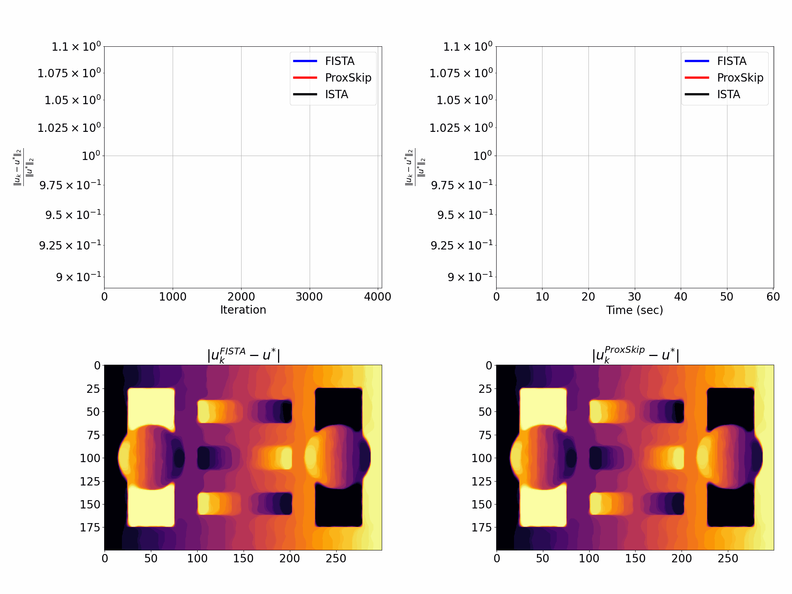

# Why do we regularise in every iteration for imaging inverse problems

Code to reproduce results for [SSVM 2025](https://sites.google.com/view/ssvm-2025/home-page) paper ["Why do we regularise in every iteration for imaging inverse problems?"](https://arxiv.org/abs/2411.00688) by Evangelos Papoutsellis, Zeljko Kereta, Kostas Papafitsoros.

### Abstract
Regularisation is commonly used in iterative methods for solving imaging inverse problems. Many algorithms involve the evaluation of the proximal operator of the regularisation term in every iteration, leading to a significant computational overhead since such evaluation can be costly. In this context, the ProxSkip algorithm, recently proposed for federated learning purposes, emerges as an solution. It randomly skips regularisation steps, reducing the computational time of an iterative algorithm without affecting its convergence. Here we explore for the first time the efficacy of ProxSkip to a variety of imaging inverse problems and we also propose a novel PDHGSkip version. Extensive numerical results highlight the potential of these methods to accelerate computations while maintaining high-quality reconstructions.

### Why do we regularise in every iteration

- [for denoising?](./denoising/denoising_plots_multiple_probs.ipynb)
- [for deblurring?](./deblurring/deblurring_plots_multiple_probs.ipynb)
- [for tomography?](./tomography/tomography_plots_finden_from_pdhg_explicit_precond.ipynb)

**Quick Demo**: [](https://colab.research.google.com/github/epapoutsellis/Why-do-we-regularise-in-every-iteration/blob/main/deblurring/demo_gcolab.ipynb)    


_60 seconds. Three algorithms. One winner. Let the TV deblurring begin..."_

### Installation

We use the [Core Imaging Library (CIL)](https://github.com/TomographicImaging/CIL) with some additional [new functionalities](#Appendix). Code and installation tested on macOS (Apple M2 Pro), Linux, and Windows 10.

```
conda create --name why_skip -c conda-forge python=3.12 cmake scipy six cython numba pillow jupyterlab scikit-learn dask cvxpy zarr pywavelets astra-toolbox tqdm nb_conda_kernels

conda activate why_skip
git clone https://github.com/epapoutsellis/StochasticCIL.git
cd StochasticCIL
git checkout svrg
git tag -a v1.0 -m "Version 1.0"
mkdir build
cd build
cmake ../ -DCONDA_BUILD=OFF -DCMAKE_BUILD_TYPE="Release" -DLIBRARY_LIB=$CONDA_PREFIX/lib -DLIBRARY_INC=$CONDA_PREFIX -DCMAKE_INSTALL_PREFIX=$CONDA_PREFIX
make install
```

For windows: `cmake ../ -DCONDA_BUILD=OFF`, `cmake --build . --target install`

### New Functionalities

1) Splitting methods for Acquisition Data compatible with CIL and [SIRF](https://github.com/SyneRBI/SIRF).
2) Sampling methods for CIL Stochastic Functions (used also by SPDHG).
3) ApproximateGradientSumFunction (Base class for CIL Stochastic Functions)
4) SGFunction
5) SAGFunction
6) SAGAFunction
7) SVRGFunction
8) LSVRGFunction
9) PGA (Proximal Gradient Algorithm), base class for GD, ISTA, FISTA.  Designed for fixed and/or adaptive Preconditioners and step sizes.
10) Preconditioner (base class). An instance of Preconditioner can be passed to GD, ISTA, FISTA. 
11) StepSizeMethod (base class for step size search), including standard Armijo/Backtracking.
12) Callback utilities, including standard metrics (compared to a reference) and statistics of iterates. Any function (CIL), or callables from other libraries can be used.
13) PD3O (Primal Dual Three Operator Splitting Algorithm) which can be combined with a Stochastic CIL function.
14) SIRF Priors classes can be used in the CIL Optimisation Framework for free. In addition, SIRF ObjectiveFunction Classes can be used. This allows more flexibility for SIRF users to have control and monitor a CIL algorithm.


